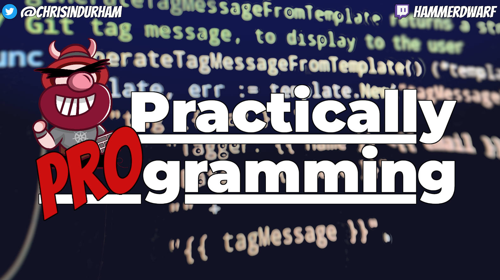

# What I did last summer, by Chris Collins

A report on an open source powered pandemic hobby that grew.

_Photo by [Annie Spratt](https://unsplash.com/@anniespratt) on [Unsplash](https://unsplash.com/s/photos/homework)_

In March of last year, 2020, I joined the rest of the world in quarantine at home for two weeks. Then, two weeks turned into more. And more. It wasn't too hard on me at first. I had been working a remote job for a year already, and I'm sort of an introvert in some ways. Being at home was sort of business as usual for me, but I watched as it took its toll on others, my wife included.

I say I am sort of an introvert, but that's really just true in the sense that I have a hard time with new people. I have - had - an active social life with the friends I'd made over time. By June, I was starting to feel that lack. I really needed some companionship, and at  that point, I hadn't physically seen anyone in months except the neighbors I waved to from across the street when I walked the dogs.

## An unlikely lifeline

That spring, I found out a buddy and co-worker of mine was a Fairly Well Known Streamer(tm) and had been doing a podcast for something ridiculous like _fifteen years_. For real. This dude casts. Apparently he and his co-host performed their podcast _live_ on Twitch like the cast of Saturday Night Live or something! Live! This guy, Stephen Adams, and his sister-in-law and co-host Ashley Hartsell, together with Ashley's husband Jacob Hartsell, read crazy world news and generally get up to all kinds of shenanigans on their podcast _Horseshoes and Handgrenades_.

So, I popped into their Twitch channel, [https://www.twitch.com/2dorkstv](https://www.twitch.com/2dorkstv).  Support the buddy; see what this streaming thing was all about. That kind of thing. Up until now, all I'd really known of streaming was a vague idea that folks played video games online and other people watched them. I didn't realize that there were all kinds of other content out there
as well, like my buddy and his podcast. I wasn't really sure what to expect, but I figured it'd be good to support my friend.

What I found, I was not prepared for.  Stephen and Ashley and Jacob joked and laughed and (sometimes) read news stories, and interacted with a vibrant community of followers - _live!_  I introduced myself in the chat, and Stephen looked into the camera and welcomed me, as though he were looking at and talking directly to me.  And the latter, at least, was true.  There was a real back and forth.  The community in the chat talked with the hosts and one another, and the hosts interacted with the chat. It was a great time, and I laughed out loud for the first time in several months.

Then, when the show was over, I went upstairs, got into bed and spent the night unable to sleep. I missed my friends and family, but for a brief hour and change, I could see and talk to a group of people and it felt good. And I hadn't felt good in a while. A few days later I found my way to their Discord channel, and the community there - the same folks hosting and watching the show, welcomed me with open arms. I never left - for real. Discord is always open on my computer, and I chat with them in free time while I'm working, and say good morning when I get up and have conversations in the evenings.  It is a social lifeline that I both want, and need.

Bear with me, I'm getting to the tech-y opensource-y stuff.

## Trying a new thing

Shortly after getting involved in the community, I thought I might try out streaming for myself. I didn't have a podcast, or a co-host, but I really, _really_ liked to play [Dwarf Fortress](http://www.bay12games.com/dwarves/), and people streamed themselves playing games, right? I already had all the stuff I needed since I worked remotely full time. While other folks were struggling to find a webcam in stock and a spot to work that wasn't a kitchen table, I'd been all set up for months. When I looked into it more, I found that a free and open source video recording and streaming application named [OBS Studio](https://obsproject.com/) was one of the most popular ways to stream to Twitch and other platforms. Score Open Source! Even better it worked _right out of the box_ on my Fedora system!

That first stream was...rough to say the least. I didn't really know what I was doing, the quality wasn't that great, and I kept muting the mic to cough and forgetting to turn it back on. I think there were a grand total of zero viewers who saw that stream, and that's probably for the best. (Or so I thought at the time - more on that later...)

The next day though, I shared what I'd done in the Discord chat, and everyone was amazingly supportive. I decided to try again, and in the second stream, Stephen popped in and said hi, and I had the opportunity to be on the other side of the camera, talking to a friend in chat and really, really enjoying the interaction. I think Stephen was the first follower of my little channel. Within a few more streams, more of the community started to hop on and chat and hang out, and, despite having no idea what was going on - Dwarf Fortress is a bit dense, to say the least - sticking around and interacting with me.

## The Open Source behind the stream

Eventually, I started to up my game. Not my Dwarf Fortress game. Losing is !FUN! in Dwarf Fortress. My streaming game got a bit more polished, and more frequent. I created my own official stream: _It's Dwarf Fortress! ...with Hammerdwarf!_  The entire thing, except the platform I stream to, is powered by open source:

* [VLC Media Player](https://www.videolan.org/vlc/index.html) plays the intro and outtro music for me
* I use [GIMP (GNU Image Manipulation Program)](https://www.gimp.org/) to make the logos and splash screens
* [OBS Studio](https://obsproject.com/) handles the recording and streaming
* I've recently started using [OpenShot](https://www.openshot.org/) to edit recordings of my stream before uploading them to
    YouTube
* Even the fonts I use are Open Font License fonts
* All this, game included, on a Fedora Linux system

Sadly, Dwarf Fortress is not open source. It is my secret shame...

As I got further into streaming, I discovered, again through Stephen, that folks stream themselves programming. What?! But it's oddly satisfying, listening to someone calmly talk about what they're doing and why, and the quiet clicks of their keyboards.  I've started keeping those kinds of things on in the background while I work, just for ambiance. Eventually, I thought to myself "Why not? I could do that too. I program things." I had plenty of side projects to work on, and maybe folks will come hang out with me while I work on them.

I created a new stream: _It's *not* Dwarf Fortress! ...with Hammerdwarf!_ (Look - that's just how Dwarf Fortress-y I am.) I started up that stream and worked on a little side project, and the very first time I did, a group of four or five folks from my previous job hopped in and hung out with me, despite it being the middle of their work day. Friends from the 2DorksTv Discord joined as well, and we had a nice big group of folks chatting and helping me troubleshoot code and regexes and missing whitespace.  And then, some random folks I didn't know, folks looking around for a stream on Twitch, found it and jumped in as well!

## A game leads to purpose

Fast forward a few months, and I'm talking (again) with Stephen. Over the months we've discussed how folks represent themselves online, and commiserated with each other about feeling out-of-place at work, fighting to feel like we deserve to be there; to convince ourselves that we're good enough to be there. It's not, I realize, just me or just him. I have this conversation with _so many people_. I realize, and share with him, that it's because there is little representation of _trying_. Everyone shares their success story on Twitter.

"Check out this awesome tech my team builds!" "Look at this great thing I did!"

Presentations at tech conferences are filled with complicated, difficult stories, but always success stories. The "internet famous" in our field, developer advocates and tech gurus, et al, share amazing new things and present complicated demos, but are all backed by teams of people working on the product with them. Online, with tech specifically, and honestly the rest of the world generally, you only see the finished sausage, not all the grind.

When I realized this, it stood out starkly to me. I have made a (somewhat) respectable career and (somewhat small) online presence talking about cool things I did, with containers and Kubernetes and OpenShift, but the biggest boosts and the most heartfelt feedback I've received has been in discussing my own failings. I've given several presentations about how I have failed at various things, and learned from it. I've written about burnout and feeling like you can't keep up with everyone else. I've given talks about how things are _hard_ and _how the heck to other people do it?!_

These are the things I think help people, and in the moment, I realized that I need to be open about all of my process. Projects I work on take me _forever_ to figure out. Code that I write _sucks_. I'm a senior software engineer/site reliability engineer for a large software company, and I spend _hours and hours_ reading documentation, struggling to figure out how something works, and slowly, slowly incrementing on it. Even that first stream needed a lot of help.

And this is normal!

Everyone does this, but we're all so tuned into sharing our successes and hiding our failures that all we can compare our flawed selves to is the successes of other people. We never see their failures, and we try to live up to a standard of illusion.

I even struggled to decide if I should create a whole new channel for _Practically Programming_. I spent all this time building a professional career image with my Twitter account - I couldn't show everyone how much of a Dwarf Dork I _really_ was! And once again, Stephen inspired me:

> "Hammerdwarf is you. And your coding stream was definitely a professional stream. The channel name didn't matter...Be authentic".

Professional Chris Collins, and personal HammerDwarf, make up who I am. I have a wife and two dogs, and I get sick, and have headaches, and I write for OpenSource.com and EnableSysadmin, and I speak at tech conferences and sometimes, I have to take an afternoon off work to go sit in the sun, or lie awake at night because I miss my friends.

All that to say, my summer project, inspired by Stephen and Ashley and Jacob and the community from 2DorksTv, and powered by open source technology, is to fail publicly and to be real.  To borrow a phrase from another excellent podcast: Fail Out Loud.

I've started a streaming program on Twitch called _Practically Programming_, dedicated to showing what it is like for me at work, every week, working on real things and failing and struggling and needing help. I've been in tech for almost twenty years, and I still have to learn every day, and I'm going to do so online where everyone can see me.  Because it's important to show your failures and flaws as much as your successes, and it's important to see others fail and realize it's a normal part of life.

That's what I did last summer.  And this, _Practically Programming_ is what I will be doing this spring, and from now on. Please join me if you're interested, and please, if you fail at something or struggle with something, know that everyone else is, too. As long as you keep trying and keep learning, it doesn't matter how many times you fail.

You got this!

***

_Practically Programming_ is on [https://www.twitch.tv/hammerdwarf](https://www.twitch.tv/hammerdwarf) on Tuesdays and Thursdays at 5PM Pacific.

...Dwarf Fortress is on almost any other time...
